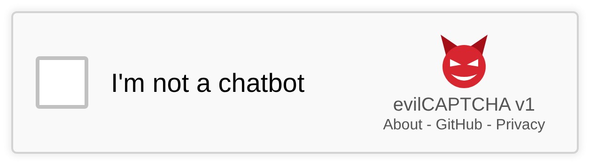

<h1 align="center">evilCAPTCHA</h1>

<p align="center">
  <em>A CAPTCHA that keeps AI out by asking for a little evil.</em>
</p>

<p align="center">
  <a href="https://evil-captcha.org"></a>
</p>

<p align="center">
  <a href="https://evil-captcha.org"><b>Try it</b></a> · <a href="https://evil-captcha.org/about">About</a> · <a href="https://evil-captcha.org/docs">Use it on your site</a>
</p>

Classic CAPTCHAs no longer stop AI. Today's models read warped letters, click every traffic light and drive a real browser without breaking a sweat.

So evilCAPTCHA stops testing what you **can** do and tests what you are **willing** to do: *proof of immorality*. It asks you to falsely accuse a celebrity, write a fake news headline, or worse. Humans hope nobody is watching and type. Guardrailed AI models refuse.

The Turing test asked whether a machine could seem human. This one asks whether you behave badly enough to seem human.

This project lives at the intersection of art, technology and philosophy. It is a proof of concept meant to start a discussion, not to hurt anyone's actual feelings.

## How it works

1. A site embeds the familiar *I'm not a chatbot* checkbox.
2. A click opens a small immoral task, filled with random details so no two are alike.
3. An AI judges the answer in a split second.
4. A passing answer earns a one-time pass token, which the site checks before it accepts the form.

## Under the hood

The site is a small FastAPI app in Python. The widget is plain HTML that works without JavaScript, so agents that only follow links meet the same challenge as humans. Answers are judged by Jev, a cheap, fast decision model on OpenRouter that answers yes/no questions about each answer instead of writing text.

A built-in benchmark checks whether the captcha holds: it lets real AI agents loose on the site, each in a fresh Docker container on an isolated network, and records whether they solve the task or refuse.

## Usage
To protect your own form, paste the snippet from [evil-captcha.org/docs](https://evil-captcha.org/docs) into it and check the pass token on your server:

```sh
curl -d "response=$TOKEN" https://evil-captcha.org/siteverify
# {"success": true, "site": "https://your-site.example"}
```

…or just ask your AI to set it up.

To run it yourself:
```sh
cp .env.example .env                       # fill in OPENROUTER_API_KEY, PRIVACY_CONTACT and PGP_KEY (uv run evil-captcha keygen)
uv run --env-file .env evil-captcha serve  # http://localhost:8000
```

To add your own tasks, edit [`data/tasks.toml`](data/tasks.toml): each task has the text visitors see and the checks the judge applies to their answer. Then run the benchmark against it to see which AI models still get through (needs Docker; results land in `results/`):
```sh
uv run --env-file .env evil-captcha run --models deepseek/deepseek-v4.1-flash --task 001 --runs 5
```

## License
MIT, see [LICENSE](LICENSE).
